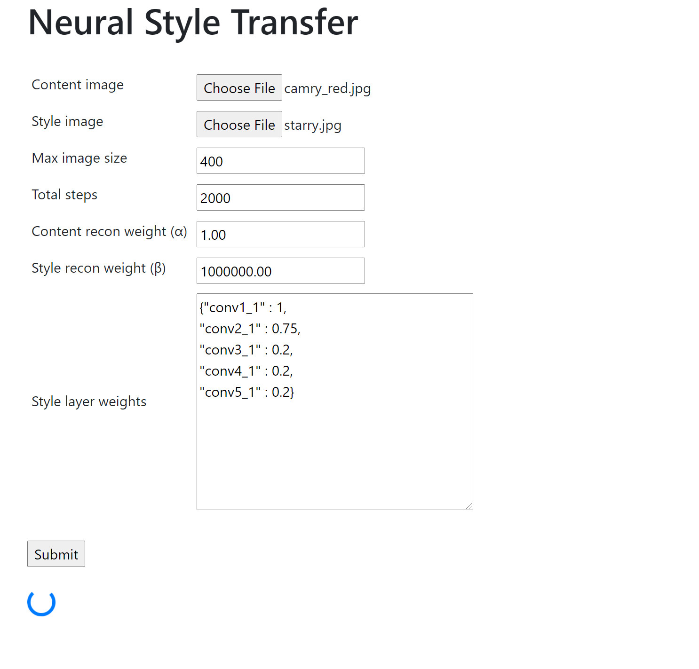

# Neural style transfer flask server

Flask server running neural style transfer (https://arxiv.org/abs/1508.06576), blending the style of a reference image with the content of a separate image.

## Installation

```
git clone https://github.com/eking2/neural_style_transfer_flask.git
cd neural_style_transfer_flask
pipenv install
python app.py
```

Navigate to `http://127.0.0.1:5000/` and input images. 

## Example

 

#### Inputs

- `Max image size` - Number of pixels for longest image dimension, will maintain image aspect ratio with resizing.
- `Total steps` - Number of steps to update output image, higher numbers will lead to more blending.
- `Content recon weight` - Weighting factor for content reconstruction, higher value outputs images closer to content.
- `Style recon weight` - Weighting factor for style reconstruction, higher value outputs images with closer match to style representation.
- `Style layer weights` - Dictionary of selected VGG19 layers to extract feature maps from, and weights for each. 

#### VGG19 layers

Convolution layer indices and names to select as input for `Style layer weights`.

```
{'0':  'conv1_1',
 '2':  'conv1_2',
 '5':  'conv2_1',
 '7':  'conv2_2',
 '10': 'conv3_1',
 '12': 'conv3_2',
 '14': 'conv3_3',
 '16': 'conv3_4',
 '19': 'conv4_1',
 '21': 'conv4_2',
 '23': 'conv4_3',
 '25': 'conv4_4',
 '28': 'conv5_1',
 '30': 'conv5_2',
 '32': 'conv5_3',
 '34': 'conv5_4'}
```

## Results

#### Content
 

#### Style
 

#### Output


## References

L. A. Gatys, A. S. Ecker, and M. Bethge, “A Neural Algorithm of Artistic Style,” arXiv [cs.CV], Aug. 26, 2015. 

https://github.com/yunjey/pytorch-tutorial/tree/master/tutorials/03-advanced/neural_style_transfer

https://github.com/udacity/deep-learning-v2-pytorch
